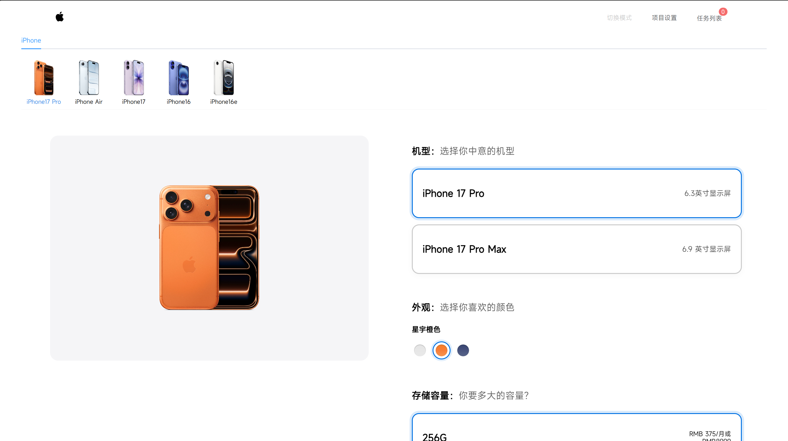
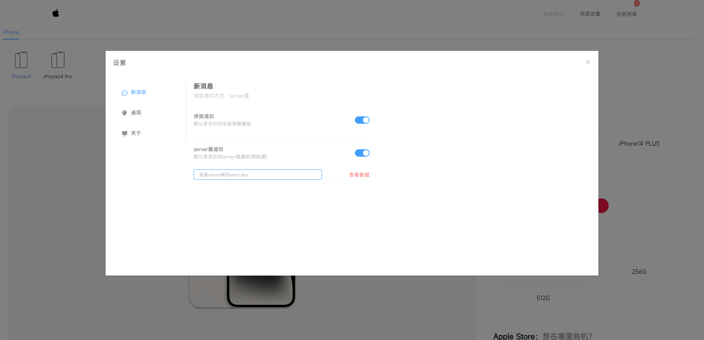
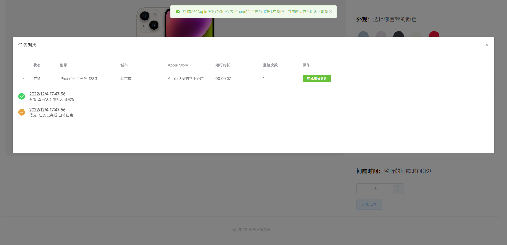

<!--
 * @Author: KESHAOYE
 * @Date: 2022-12-04 17:36:16
-->
# 大陆Apple Store货源监控  :iphone:

    

>用于监控apple store对应商品是否有现货<br />
>By KESHAOYE

##### 效果图




# 优势

:star2: 亮点功能&nbsp;&nbsp;&nbsp;&nbsp;&nbsp;:rocket:未来功能（计划、大饼）
* :star2:全新支持iPhone15系列
* :star2:支持多商品、多商店同时监听
* :star2:支持server酱、浏览器弹窗、Message消息提示+音频提示等多种方式通知
* :star2:支持单独中断某一任务的监听
* :rocket:支持一键监听所有产品
* :rocket:支持ipad、mac及官翻产品...

# 使用

#### 安装启动：
安装依赖：
```
npm i
```
启动：
```
前端：
npm run serve
```   

#### 开始任务：
1.点开头部的项目设置，按需设置。<br />
2.设置结束后在首页选择要监听的产品及商铺名称。<br />
3.点击添加任务，确认无误后即开始监听。（可回到首页继续添加）<br />
4.可点开右上角的任务列表查看监听情况及结束任务<br />

# 敬请期待

会不断更新完善新功能、修复BUG。
期待小伙伴们的star和PR。 :muscle: :muscle: :muscle: