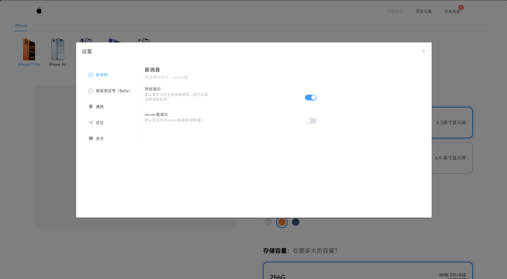

<!--
 * @Author: KESHAOYE
 * @Date: 2022-12-04 17:36:16
-->

# 大陆 Apple Store 货源监控 :iphone:

  

> 用于监控 apple store 对应商品是否有现货<br />
> By KESHAOYE

##### 效果图





# 优势

:star2: 亮点功能&nbsp;&nbsp;&nbsp;&nbsp;&nbsp;:rocket:未来功能（计划、大饼）

- :star2:全新支持 iPhone16 系列
- :star2:支持多商品、多商店同时监听
- :star2:支持 server 酱、浏览器弹窗、Message 消息提示+音频提示等多种方式通知
- :star2:支持单独中断某一任务的监听
- :rocket:支持微信消息号通知
- :rocket:支持一键监听所有产品
- :rocket:支持 ipad、mac 及官翻产品...

# 使用

#### 安装启动：

安装依赖：

```
pnpm i
```

启动：

```
前端：
pnpm run serve
```

#### 开始任务：

1.点开头部的项目设置，按需设置。<br /> 2.设置结束后在首页选择要监听的产品及商铺名称。<br /> 3.点击添加任务，确认无误后即开始监听。（可回到首页继续添加）<br /> 4.可点开右上角的任务列表查看监听情况及结束任务<br />

# 更新日志

## 1.3.0（250828）

- 技术栈全面升级，速度更快更流畅
- 页面布局优化
- 支持更多设置项
- 通知内容优化
- 用户体验调整

# 敬请期待

会不断更新完善新功能、修复 BUG。
期待小伙伴们的 star 和 PR。 :muscle: :muscle: :muscle:
